## CONFIG APPS

-   setup .env

-   LOGIN DI MAILTRAP.IO UNTUK CEK LINK EMAIL SEPERTI FORGOT PASSOWORD dan setting smtp menggunakan laravel 9+

-   composer require intervention/image to install image intervention

-   php artisan make:model BookArea

http://localhost:8000/admin/login admin@gmail.com : admin789

-   LAKUKAN LANGKAH BERIKUT UNTUK MENCOBA STRIPE
    composer require stripe/stripe-php
    composer dump-autoload
    php artisan cache:clear
    php artisan config:clear
    php artisan view:clear
    php artisan optimize

card : 4242 4242 4242 4242

-   composer require barryvdh/laravel-dompdf
-   php artisan vendor:publish --provider="Barryvdh\DomPDF\ServiceProvider"

*   Tampilan Dashboard
*   Manage Team :
    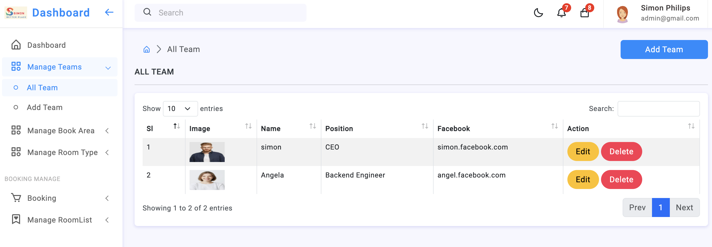
    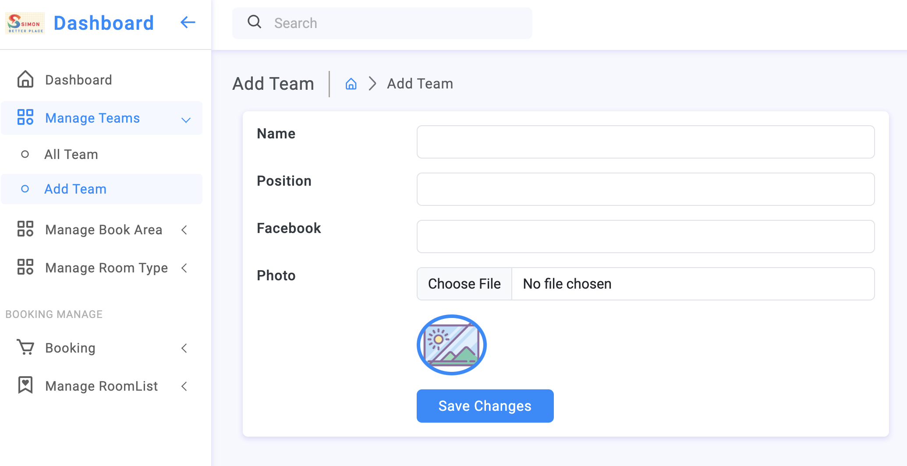
*   Manage Booking :
    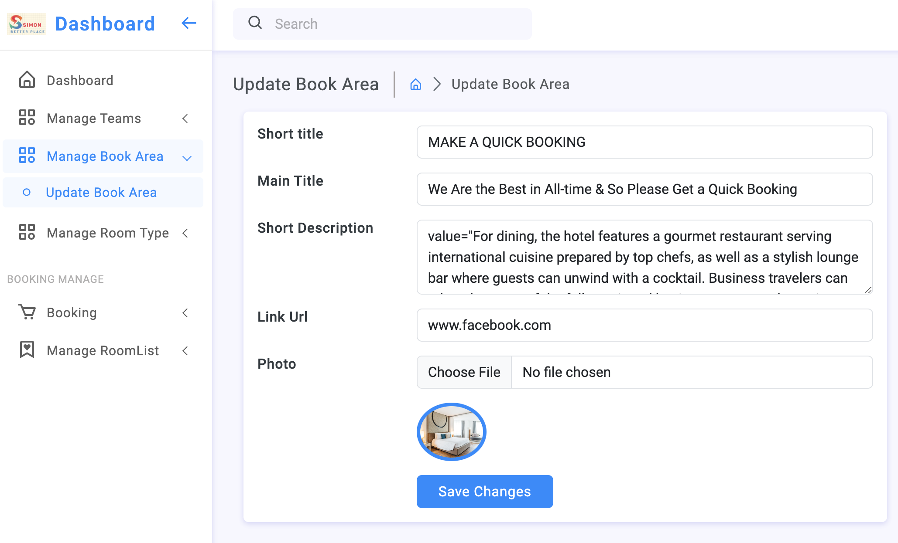
*   Manage Room :
    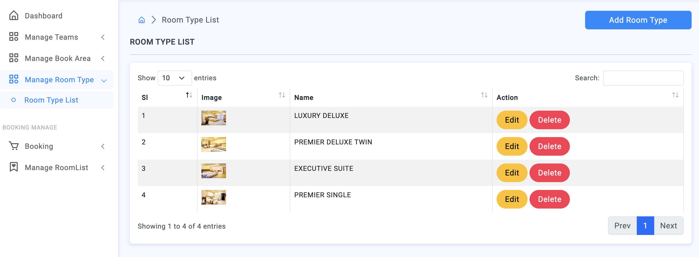
    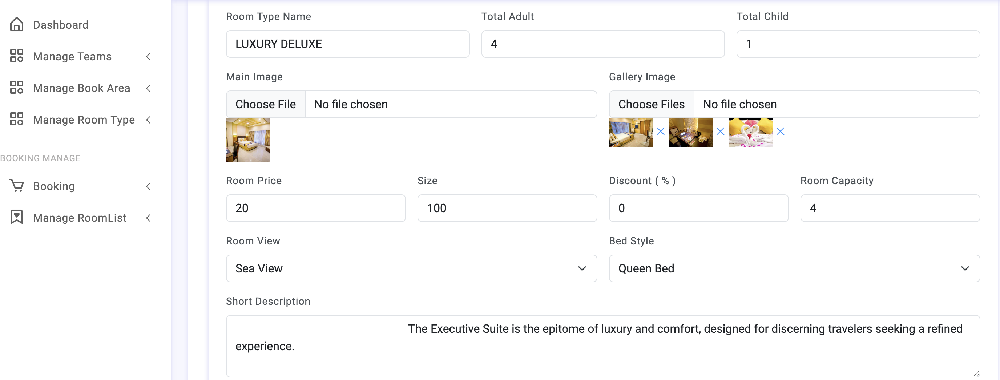
    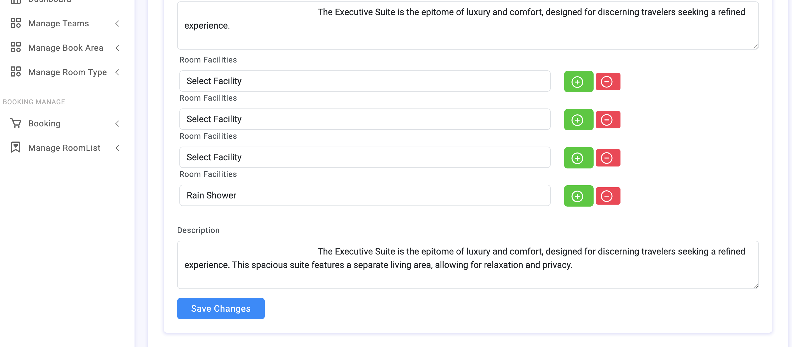
    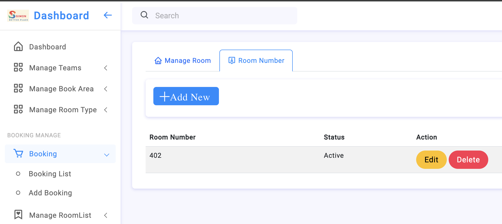
*   Manage List Booking :
    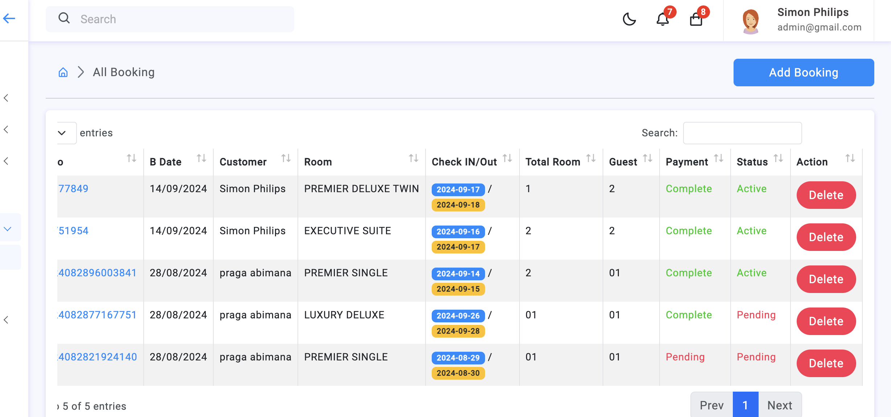
    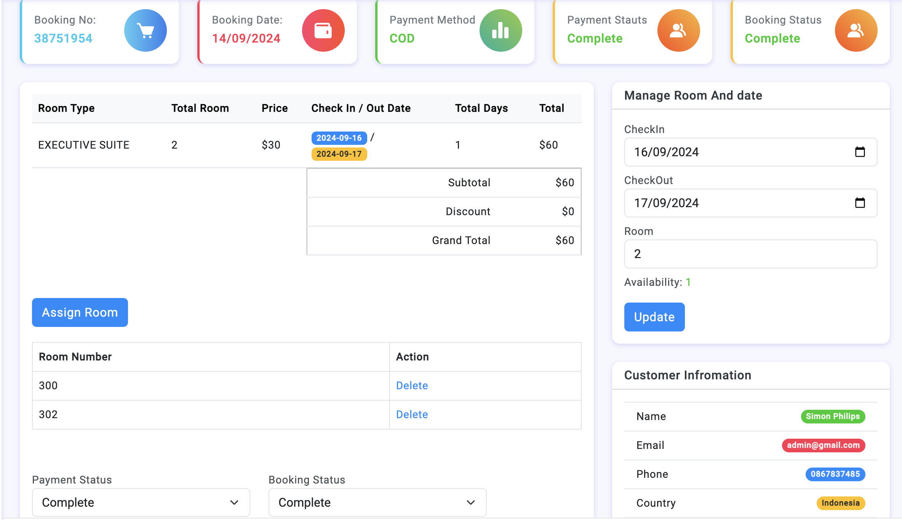
    
    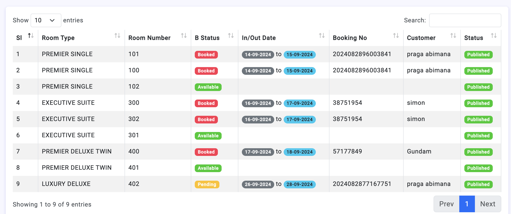

*   MANAGE FRONT END
    
    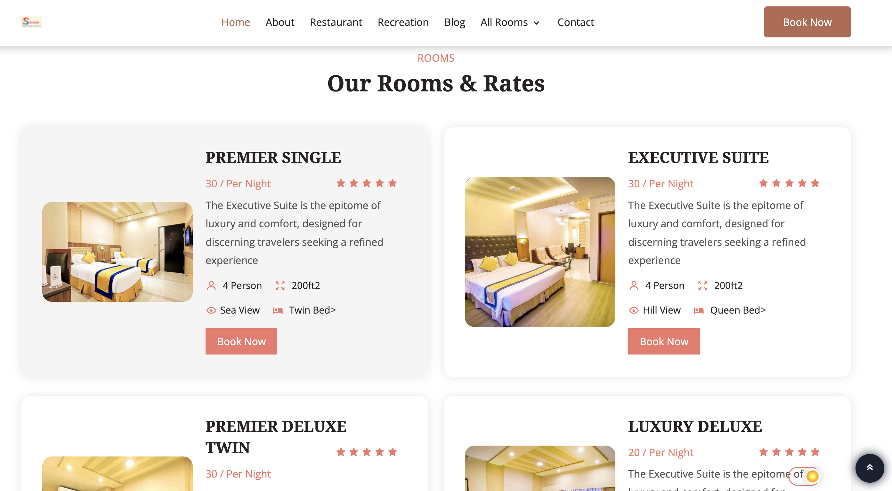
    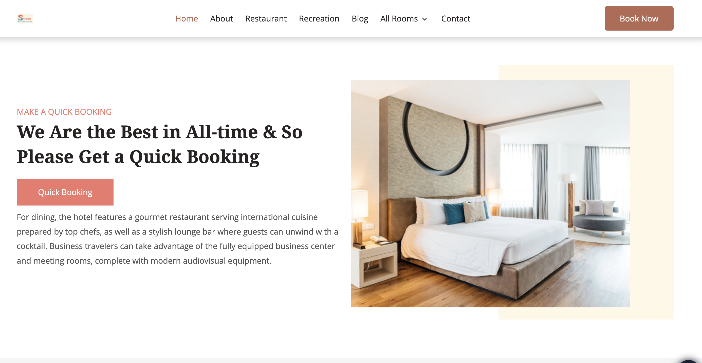
    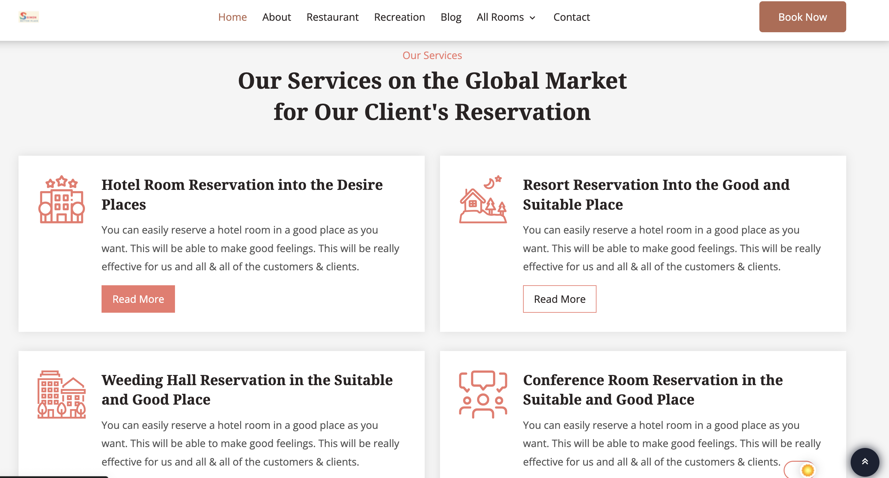
    
    
    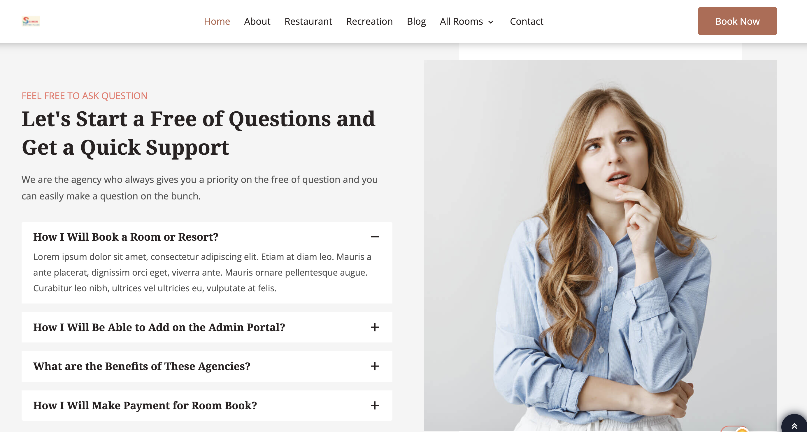
    
